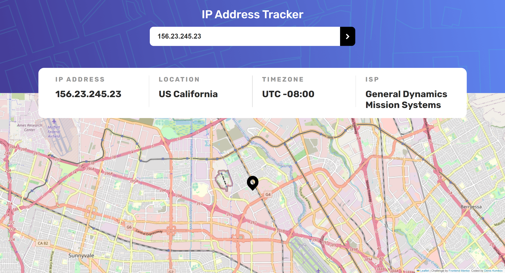
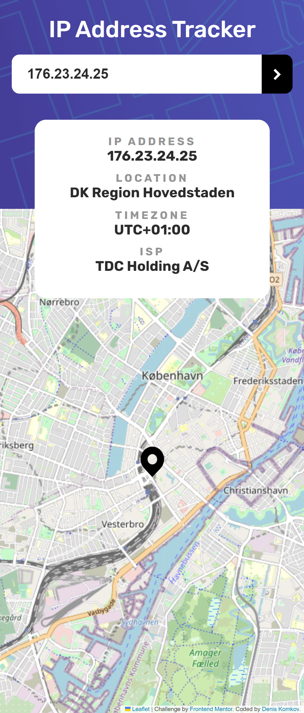

# Frontend Mentor - IP address tracker solution

This is a solution to the [IP address tracker challenge on Frontend Mentor](https://www.frontendmentor.io/challenges/ip-address-tracker-I8-0yYAH0).

### Screenshot

### Built with

-   JS
-   HTML
-   CSS
-   [Leaflet](https://leafletjs.com/index.html) - JS library for interactive maps
-   [IP Geolocation API](https://geo.ipify.org/) - Real-time IP Geolocation API
-   [Parcel](https://parceljs.org/) - Build tool
# ip-address-tracker
